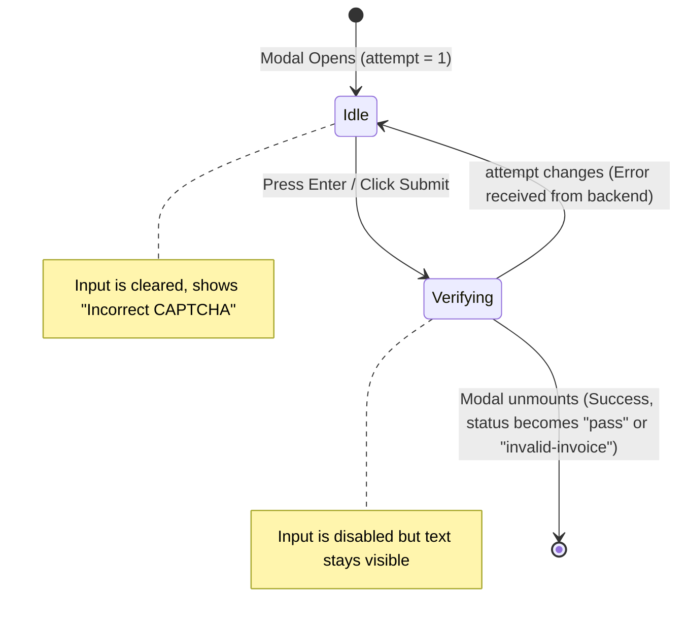

# Design Specification: CAPTCHA Verification & Feedback Flow

This document details the design and architecture for adding premium, user-friendly visual feedback and state management to the CAPTCHA entry flow in the VATOCR application.

## 1. Problem Description
Currently, when the user inputs a CAPTCHA and submits it:
- The input is immediately cleared on the frontend.
- There is no visual feedback indicating that the backend is actively submitting/verifying the CAPTCHA.
- If the CAPTCHA was wrong, the image silently replaces the old one, and the user's input disappears, leaving them with no clear indication of whether their previous entry was right, wrong, or still processing.

## 2. Goals & Success Criteria
- **Visual Feedback:** Provide immediate feedback on submit by entering a disabled "Verifying..." state with a loading message.
- **Input Persistence:** Keep the entered text visible but disabled while verification is underway, so the user knows what they typed.
- **Error Identification:** Clearly indicate to the user if their previous attempt was incorrect.
- **State Transition:** Automatically clear the input, re-enable the fields, and show the new CAPTCHA image with a warning message once the backend loads the next CAPTCHA attempt.
- **Automatic Cleanup:** Close the modal immediately when verification succeeds.

## 3. Proposed Changes

### Frontend: `src/components/CaptchaModal.jsx`
We will rewrite the component to handle local verification states and react to prop changes via standard React hooks:

1. **State:**
   - `answer` (string): Stores the current input value.
   - `isSubmitting` (boolean): Tracks whether a submission is in-flight.

2. **Prop Syncing (`useEffect`):**
   - Add a `useEffect` hooked to `[imageBase64, attempt]`.
   - When a new CAPTCHA or attempt is sent by the backend, reset `isSubmitting` to `false` and clear `answer` to `''`.

3. **Submitting State:**
   - On form submit, set `isSubmitting` to `true` and call the `onSubmit(answer)` callback.
   - Do NOT clear the input field inside `handleSubmit`.

4. **UI Elements:**
   - If `isSubmitting` is `true`, disable the input field, the "Skip Invoice" button, and the "Submit" button.
   - Render a themed loading message: `⏳ Verifying CAPTCHA, please wait...`
   - If `attempt > 1` and `!isSubmitting`, render a red warning message: `❌ Incorrect CAPTCHA. Please try again (Attempt X).`

---

## 4. State Transition Diagram

