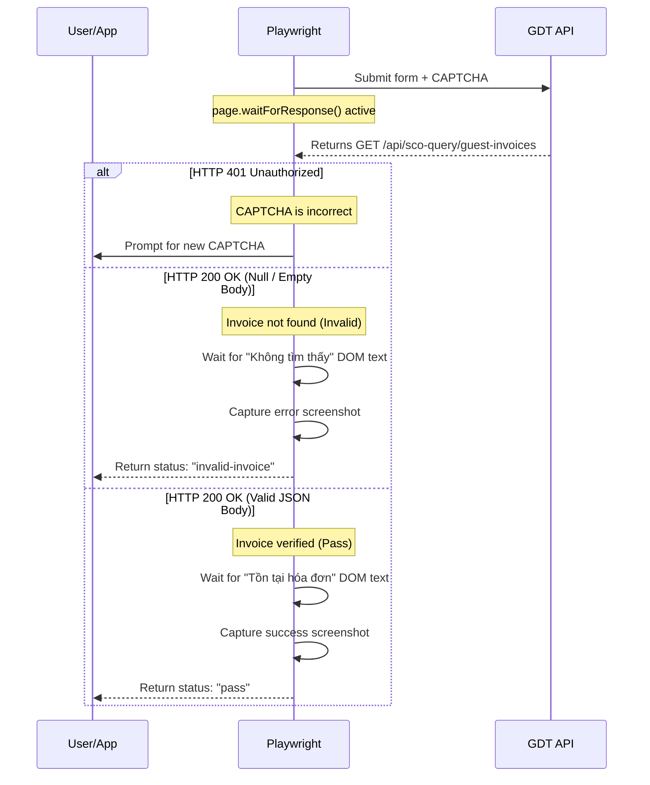

# Design Specification: Site 1 API Response Interception

We are optimizing the invoice validation process on Site 1 (`hoadondientu.gdt.gov.vn`) by intercepting and reading the API response directly instead of relying on arbitrary DOM/networkidle waits.

## Goals
- Detect wrong CAPTCHAs immediately using the GDT API response (**HTTP 401 Unauthorized**) for ultra-fast retries.
- Detect invoice validation results (**HTTP 200 OK** with non-null JSON vs null/empty JSON) instantly and precisely.
- Eliminate slow and fragile `page.waitForLoadState('networkidle')` calls.
- Wait exactly for the corresponding UI result text to render before capturing the screenshot, ensuring clear visual records.

## Architecture & Data Flow

## Detailed Changes

### `backend/automation/site1.js`
Modify the loop after CAPTCHA input to:
1. Initialize a `responsePromise` using `page.waitForResponse` before clicking search.
2. Click the search button.
3. Await `responsePromise`.
4. Parse response status and body:
   - Status 401: Incorrect CAPTCHA -> log and `continue` retry loop.
   - Status 200: Parse body:
     - Null/empty: Wait for error selector (`text=Không tìm thấy`), screenshot, and return `{ ok: true, screenshotBase64, status: 'invalid-invoice' }`.
     - Valid JSON: Wait for success selector (`text=Tồn tại hóa đơn có thông tin trùng khớp`), screenshot, and return `{ ok: true, screenshotBase64, status: 'pass' }`.
5. Fallback: If network timeout or other status occurs, fall back to checking if captcha input `input#cvalue` is still visible.

## Verification Plan

### Manual Verification
1. Run application in development mode (`npm run dev`) or package it (`npm run pack`).
2. Run automation with a valid invoice. Ensure:
   - Correct CAPTCHA results in immediate success.
   - Wrong CAPTCHA results in immediate retry without long timeouts.
3. Run automation with an invalid invoice (e.g. incorrect amount). Ensure:
   - It captures the "Không tìm thấy" status and marks it as invalid immediately.

### Automated Tests
Run `npm test` to verify no regressions in existing routes and store management.
