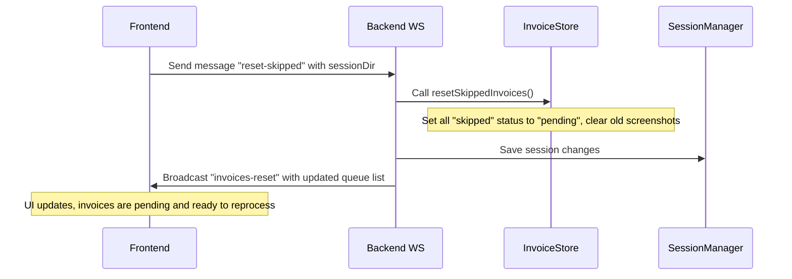
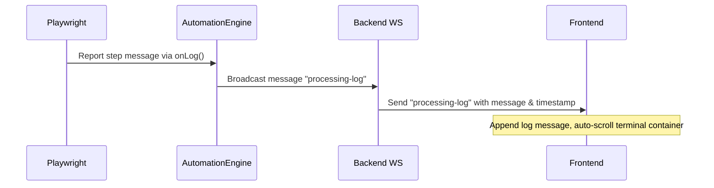

# Design Specification: Skipped Invoices Reprocessing & Sliding Live Activity Log Console

This specification outlines the design and architectural choices for allowing users to reprocess skipped invoices and viewing Playwright automation steps in a sliding glassmorphic live console on the frontend UI.

## Goals
- Allow users to reset and reprocess skipped invoices easily from the dashboard.
- Display real-time progress steps showing exactly what Playwright is doing in the browser (e.g. navigation, field entry, captcha prompts, API results).
- Present the live log console under an expandable accordion located inside a toggleable sliding right-hand sidebar.
- Automatically slide open the console when processing begins to show active progress, with manual toggle controls in the header.

## Architecture & Data Flow

### 1. Reprocessing Skipped Invoices

### 2. Live Activity Log Console

## Detailed File Changes

### Backend

#### `backend/invoiceStore.js`
Create the `resetSkippedInvoices` function to find all skipped invoices, reset their status to `'pending'`, clear screenshots, and return the count of reset invoices.

#### `backend/wsHandler.js`
Listen for a new WebSocket message type `'reset-skipped'`:
- Call `resetSkippedInvoices()`.
- Save the updated session.
- Broadcast `{ type: 'invoices-reset', payload: getInvoices() }` to all clients.

#### `backend/automation/automationEngine.js`
- Create a `logStep(invoiceId, message)` helper that broadcasts `{ type: 'processing-log', payload: { invoiceId, message, timestamp } }` events.
- Pass a callback `(msg) => logStep(invoice.id, msg)` as the fourth parameter to both `runSite1` and `runSite2`.
- Clear the console logs at the start of `startProcessing()`.

#### `backend/automation/site1.js` & `backend/automation/site2.js`
Accept `onLog` as an additional parameter and trigger it at key operations:
- Navigating to URL.
- Bypassing modals.
- Filling form criteria.
- Capturing/submitting CAPTCHA.
- API status evaluation results.

### Frontend

#### `src/components/LiveConsole.jsx` (New Component)
- Styled as a sleek, glassmorphic terminal (featuring classic 3-dot Mac controls, neon cyan timestamps, and automatic scroll-to-bottom).
- Displays a clean italic placeholder when empty.
- Encased in an expandable accordion header with status indicators (pulsing green when processing, grey when idle).

#### `src/index.css`
Add new classes:
- `.app-layout`: Flex container supporting a primary left column and a sidebar right column.
- `.layout-left`: Smooth transitional transitions for expanding full width.
- `.layout-right`: Sidebar drawer with transitions support (`transform: translateX(100%)` to `translateX(0)`).
- `.live-console` terminal-styling rules.
- Toggle console buttons and badge style selectors.

#### `src/App.jsx`
- Add states: `logs` (array of logs), `showConsole` (boolean, default false).
- Clear `logs` and automatically open console (`setShowConsole(true)`) when `handleStartProcessing` is called.
- Wire `'invoices-reset'` and `'processing-log'` WS events in `handleWsMessage`.
- In the header, add a **"📋 Activity Log"** button that toggles `showConsole` state.
- Render the new `app-layout` layout containing `layout-left` and `layout-right` side-by-side.

## Verification Plan

### Manual Verification
1. Open the application, upload invoices, and skip at least one of them.
2. Verify that a **"🔄 Reset Skipped to Pending"** button appears, and clicking it updates the skipped statuses back to pending.
3. Start processing and verify:
   - The right-hand console sidebar automatically slides open.
   - The log accordion expands, and real-time steps scroll dynamically.
   - The glowing indicator pulses green during automation.
   - Clicking "Close Log" in the header collapses it smoothly back into full width.

### Automated Tests
Run `npm test` to verify no regressions in our Jest test suites.
