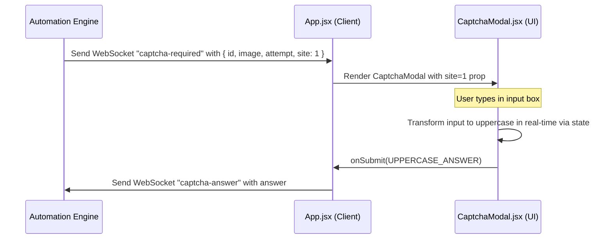

# Design Spec: Uppercase CAPTCHA for Site 1

This document describes the design for converting CAPTCHA entries to uppercase in real-time as the user types them, specifically when resolving CAPTCHAs for Site 1 (GDT Invoice Portal).

## Purpose & Requirements
*   **Requirement**: When the user enters the CAPTCHA for Site 1, the text input should automatically convert to uppercase in real-time.
*   **Scope**: This behavior must ONLY apply to Site 1 (GDT Invoice Portal). Site 2 (GDT Taxpayer Portal) CAPTCHA input should remain unaffected (normal casing behavior).
*   **Implementation**: Real-time programmatic state conversion in React (`.toUpperCase()`).

## Architecture & Data Flow



## Component Changes

### 1. Backend: Automation Engine
File: [automationEngine.js](file:///C:/Users/KhanhChuNgoc/Documents/Personal%20Projects/VATOCR/backend/automation/automationEngine.js)
*   Modify `waitForCaptchaAnswer(invoiceId, base64Image, attempt, site)` to accept a fourth parameter `site`.
*   Include `site` in the WebSocket payload of the `captcha-required` event.
*   Update Phase 1 invocation: `waitForCaptchaAnswer(invoice.id, img, att, 1)`
*   Update Phase 2 invocation: `waitForCaptchaAnswer(representativeInvoice.id, img, att, 2)`

### 2. Frontend: App Component
File: [App.jsx](file:///C:/Users/KhanhChuNgoc/Documents/Personal%20Projects/VATOCR/src/App.jsx)
*   Pass the `site` property from `captchaData` down to `CaptchaModal` as a prop.

### 3. Frontend: CaptchaModal Component
File: [CaptchaModal.jsx](file:///C:/Users/KhanhChuNgoc/Documents/Personal%20Projects/VATOCR/src/components/CaptchaModal.jsx)
*   Accept `site` prop.
*   Update the `input` field's `onChange` event:
    ```javascript
    onChange={(e) => {
      const val = e.target.value;
      setAnswer(site === 1 ? val.toUpperCase() : val);
    }}
    ```

## Testing & Verification
1.  Verify that when a CAPTCHA modal is shown for Site 1, typing any lowercase characters automatically converts them to uppercase in the input field.
2.  Verify that when a CAPTCHA modal is shown for Site 2, lowercase typing is preserved.
3.  Ensure existing automated test suites in the `backend/__tests__` directory continue to pass.
